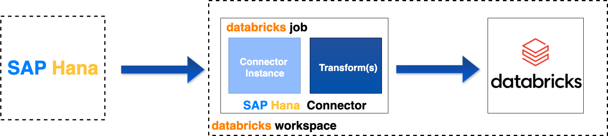

# Introduction   

  
Welcome to the **SAP HANA to Databricks Integration Guide**! This guide provides clear, step-by-step instructions to help you:  
- Set up the SAP HANA connector.  
- Configure the required environment parameters.  
- Execute the data extraction process using Databricks Jobs.  

## Why Use Our Connector?  
Our SAP HANA connector is designed for **distributed mode on Apache Spark**, enabling:  
- **Efficient data processing at scale.**  
- **Optimized performance** for big data applications.  

## Quick Navigation  
- [Prerequisites](./prerequisites.md)  
- [Configuration](./configuration.md)  

## Key Steps Covered in This Guide  
1. **Import the Connector**: Add the required wheel file to your Databricks workspace.  
2. **Set Up Databricks Jobs**: Deploy and configure jobs for the SAP HANA connector.  
3. **Environment Setup**: Configure parameters and dependent libraries.  
4. **Monitor and Troubleshoot**: Check job execution logs for smooth operation.

  <iframe
    id="usagevideo"
    title="Usage Tutorial"
    style="max-width: 100%; max-height: 100%; border: none"
    width="560"
    height="315"
    src="https://www.youtube.com/embed/azkEQmGVEd0?"
    allowfullscreen>
  </iframe>

> **Note:** For a quick overview, you can watch the video above:
---

Before diving in, ensure you’ve completed all [Prerequisites](./prerequisites.md) to set up your environment for success.
