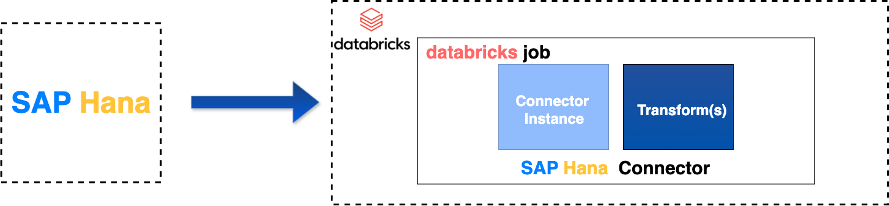

## Introduction 
Welcome to the SAP HANA to Databricks Integration Guide. This documentation provides step-by-step instructions on how to ingest data from SAP HANA into Databricks, enabling seamless data transfer and processing. You will learn how to set up the SAP HANA connector, configure necessary environment parameters, and execute the data extraction process using Databricks Jobs.

  

**The guide covers the following key steps:**
1. Importing the necessary wheel file into your Databricks workspace.
2. Deploying and configuring a Databricks job to run the SAP HANA connector.
3. Setting environment parameters and dependent libraries for a successful execution.
4. Monitoring the job run and checking the execution logs for troubleshooting.

By the end of this guide, you will be able to automate the extraction of data from SAP HANA to Databricks and ensure smooth integration with your workflows.

Start the documentation by making sure, all of the [prerequisities](./prerequisites.md) are fullfilled.
