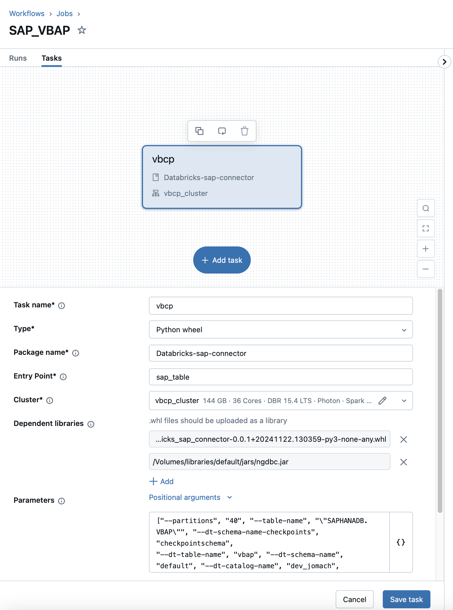

# Configuration and Usage


### How to Ingest Data from SAP HANA to Databricks
   > **Note**: Make sure the [prerequisities](./prerequisites.md) are met.
<div style="display: flex; justify-content: center; align-items: center; margin: 0; padding: 0;">
  <iframe
    id="usagevideo"
    title="Usage Tutorial"
    style="max-width: 100%; max-height: 100%; border: none"
    width="560"
    height="315"
    src="https://www.youtube.com/embed/azkEQmGVEd0?"
    allowfullscreen>
  </iframe>
</div>
How to use the connector to integrate SAP HANA with databricks is demonstrated in this video, presented by our CEO, Jorge Machado. The steps are also explained and illustrated in the following sections.

## Step 1: Add the Provided Wheel File to Your Databricks Workspace

1. Import the wheel file into the workspace. The wheel file acts as a Databricks Asset Bundle, containing programming logic, metadata, and other necessary components for the connector to function.

  

1. After selecting the corresponding wheel file, confirm the import by pressing **Import**.

> **Note**: Ensure you have the required permissions to execute tasks on the linked data table.

## Step 2: Use the Wheel File to Deploy a New Job
> **Note** To make the injection of the data described in Step 2 and 3 easier you can also use the default yaml-File with your parameters. How this is done can be found [here](examples.md)

1. Go to **Databricks Workflows** and create a new job.

  

   A Job in Databricks enables you to run code (e.g., defined in a wheel file) on a cluster with specified environment parameters.

1. After creating the job, it should look like this:


1. To configure the job, set the following elements:

### Required Parameters

| **Parameter**     | **Description**                                                                           | **Value**                            |
|-------------------|-------------------------------------------------------------------------------------------|--------------------------------------|
| **Task Name**     | Name of the job to run.                                                                   | Choose individually, e.g., `test`    |
| **Type**          | Type of package used for the connector (e.g., Notebook, Python Wheel).                    | `Python wheel`                       |
| **Package Name**  | Name of the package containing the wheel file logic (defined in the Makefile file).       | `databricks-sap-connector`           |
| **Entry Point**   | Entry point containing the command for data extraction.                                   | `sap_table`                          |
| **Cluster**       | Cluster where the connector will run.                                                     | Use an appropriate available cluster |

---

### Adding Dependent Libraries

To use the SAP HANA connector, two dependent libraries are needed:
1. The added wheel file.
2. An `ngdbc.jar` file, which contains the necessary information to access the SAP HANA database and enable communication.

1. Press **Add** under **Dependent Libraries** and select the wheel file in your workspace.


2. Repeat the same steps for the `ngdbc.jar` file. 
   > **Note**: The `ngdbc.jar` file is typically located in your Volumes.

After completing these steps, the task will have the necessary information to execute the connector.

---

### Setting Environment Parameters

Define the argument parameters needed for the run:

**Example Parameter Input**:
```
["--partitions","40","--table-name","SAP_TABLE_NAME","-tpf","\"SAPSR3\".\"/CUSTOM/SAP_TABLE_NAME\"","-sc","dev_mabras.checkpointschema",
"-td","dev_mabras.example_sap.adplapsa2","-c","PLANT,RECORDMODE,BPARTNER,COUNTY_CDE,COUNTRY,REGION",
"-pk","PLANT","-if","ROW_IDENTIFIER","-url","jdbc:sap://test_url.example_sap.adplapsa2","-s","sharedsecretvault",
"--user-key","hana-username","--password-key","hana-password","--database-name","DB123"]
```

| Parameter                          | Type      | Description                                                                                                                                                                         |
|------------------------------------|-----------|-------------------------------------------------------------------------------------------------------------------------------------------------------------------------------------|
| `--partitions`                     | INTEGER   | Number of partitions to be used in the extraction                                                                                                                                   |
| `--table-name`                     | TEXT      | Name of the SAP table to be extracted                                                                                                                                               |
| `--dt-schema-name-checkpoints`     | TEXT      | Schema where to store the checkpoints. This job needs create and write permissions on this schema                                                                                   |
| `--dt-table-name`                  | TEXT      | Name of the Databricks destination table where the checkpoints are written to. Defaults to table_name. If table_name contains slashes and dots, it will be replaced by underscores  |
| `--dt-schema-name`                 | TEXT      | Schema where to store the destination table. This job needs create and write permissions on this schema                                                                             |
| `--dt-catalog-name`                | TEXT      | Catalog where to store the destination table.                                                                                                                                       |
| `--columns`                        | TEXT      | Comma-separated list of columns to select from the table.                                                                                                                           |
| `--primary-keys`                   | TEXT      | Comma-separated list of primary key columns. This is how we identify unique rows in the table and updates.                                                                          |
| `--incremental-field`              | TEXT      | Name of the incremental field to track changes on a table. This is also how spark parallelizes the workload.                                                                        |
| `--sap-hana-host`                  | TEXT      | Target URL of the HANA instance                                                                                                                                                     |
| `--sap-hana-host-extra-options`    | TEXT      | Extra options for the target URL.                                                                                                                                                   |
| `--scope`                          | TEXT      | Name of Databricks secret scope for retrieving SAP credentials                                                                                                                      |
| `--user-key`                       | TEXT      | Key for SAP username in Databricks secret scope                                                                                                                                     |
| `--password-key`                   | TEXT      | Key for SAP password in Databricks secret scope                                                                                                                                     |
| `--database-name`                  | TEXT      | SAP database name                                                                                                                                                                   |
| `--limit`                          | INTEGER   | Limit how much data will be extracted from SAP Table. Defaults to 0 (no limit)                                                                                                      |
| `--loglevel`                       | TEXT      | If true, will print debug information                                                                                                                                               |


## Step 3: Start a New Run with the Previously Created Job

Navigate to **Workflows > Jobs > {your_job_name} > Runs** and start a new run to execute the created job.


This will automatically initiate a new run of the task defined in the task section.  
The output of the run might look like this:


---

## Step 4: Check the Logs of the Run

1. Go to **Job Runs** and select the run you just executed.  
2. Here, you can review the outputs that were printed to the console during execution.  

It should look similar to this:  


---

### Explanation of Log Outputs

| Output                            | Meaning                                                                 |
|-----------------------------------|-------------------------------------------------------------------------|
| **No Checkpoint found**           | The system tried to load a checkpoint for incremental data extraction, but none were found. |
| **Loading table**                 | Indicates the system is attempting to load the corresponding SAP HALA table. |
| **Bounds**                        | Displays the shape of the table being processed.                       |
| **Writing into table**            | Specifies the table where the extracted data is being written.         |
| **Pipeline finished: None -> N**  | Indicates the pipeline has finished extracting data, starting from checkpoint `None` and is now at row `N`. |


