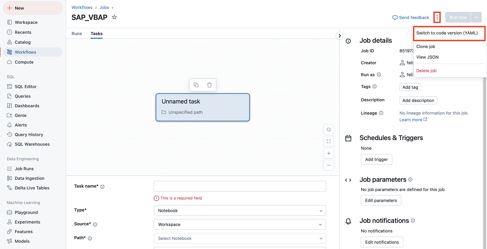

# Examples

### Create Job by using the default yaml file

To add a YAML file for a Databricks job, navigate to the **New Job** section. Click on the three dots ( **...** ) in the interface, and select the option to import the YAML configuration. Paste the following YAML file into the provided input field:

> **Note** Adjust the file so it fulfills your requirements
<details>
  <summary>Click to view the full YAML file</summary>

```yaml
resources:
  jobs:
    SAP_VBAP:
      name: SAP_VBAP
      tasks:
        - task_key: vbcp
          python_wheel_task:
            package_name: Databricks-sap-connector
            entry_point: sap_table
            parameters:
              - --partitions
              - "40"
              - --table-name
              - '"SAPHANADB.VBAP"'
              - --dt-schema-name-checkpoints
              - checkpointschema
              - --dt-table-name
              - vbap
              - --dt-schema-name
              - default
              - --dt-catalog-name
              - dev_jomach
              - --columns
              - "*"
              - --primary-keys
              - MANDT, VBELN
              - --sap-hana-host
              - ...
              - --scope
              - sharedsecretvault
              - --user-key
              - hana-db-username
              - --password-key
              - hana-db-password
              - --database-name
              - All
              - --limit
              - "1000"
              - --loglevel
              - DEBUG
          job_cluster_key: vbcp_cluster
          libraries:
            #Insert the paths to the wheel.whl and ngdbc.jar file
            - whl: /Workspace/Users/{Your Username}/SAP_Connector_New/databricks_sap_connector-0.0.1+20241122.130359-py3-none-any.whl
            - jar: /Volumes/libraries/default/jars/ngdbc.jar
      job_clusters:
        - job_cluster_key: vbcp_cluster
          new_cluster:
            cluster_name: ""
            spark_version: 15.4.x-scala2.12
            azure_attributes:
              first_on_demand: 1
              availability: ON_DEMAND_AZURE
              spot_bid_max_price: -1
            node_type_id: Standard_D4ds_v5
            spark_env_vars:
              PYSPARK_PYTHON: /databricks/python3/bin/python3
            enable_elastic_disk: true
            data_security_mode: SINGLE_USER
            runtime_engine: PHOTON
            num_workers: 8
      queue:
        enabled: true


```
</details>

> After importing the YAML file you can continue with [Step 3: Start a New Run with the previously created Job](configuration.md#step-3-start-a-new-run-with-the-previously-created-job)